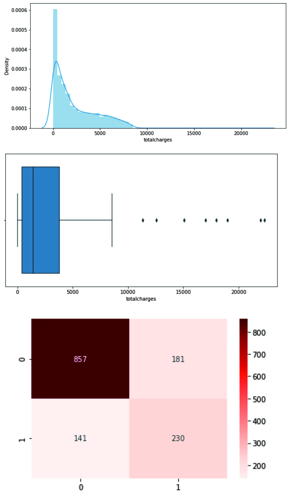

# Predict-Churned-Customer

The project to determine the churned customer based on its important features so the company can give them special treatment. I am performing comprehensive EDA on Churned Customer dataset to understand important variables, handled missing values, outliers and apply machine learning models to predict the churned customers. The model for this project is logistic regression.

## Framework Steps:

1. Data Preparation
2. Data Cleaning
3. EDA
4. Feature Engineering & Feature Scaling
5. Modeling
6. Evaluation

## Result

